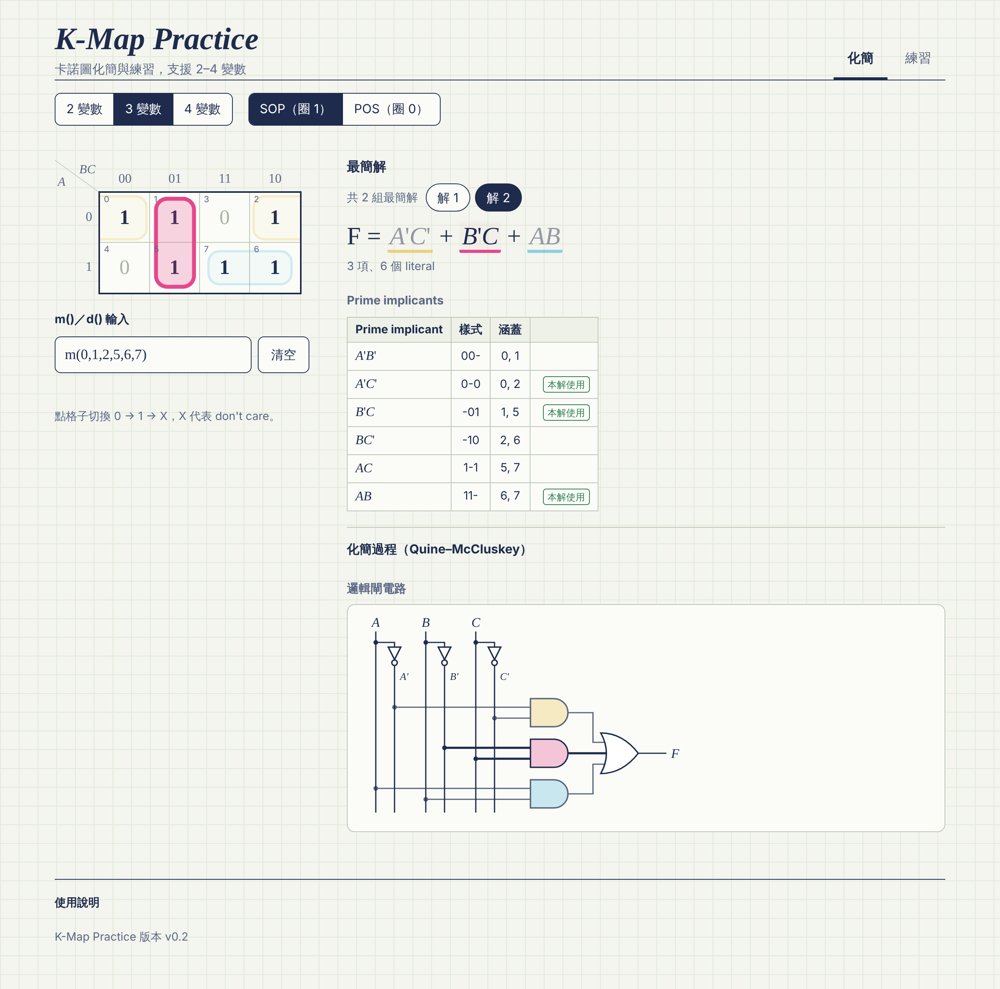
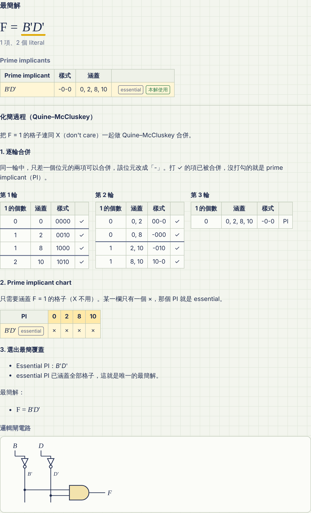
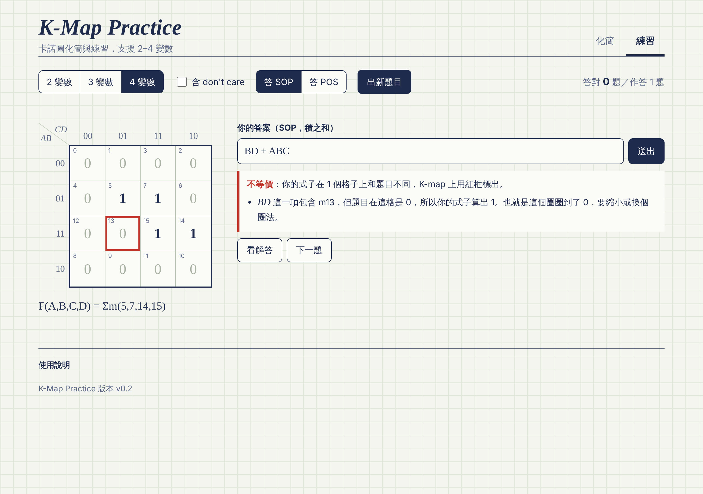
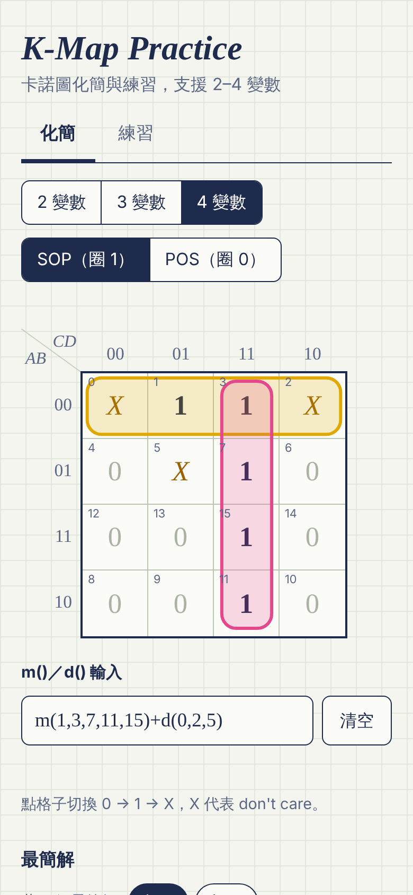

# K-Map Practice

在瀏覽器上操作的卡諾圖（K-map）化簡與練習工具，支援 2–4 變數。

- **線上使用**：https://rogerh0711.github.io/K-Map-Practice/
- **目前版本**：程式 v0.3／規格書 v1.4
- 單一 `index.html`，不需安裝、不需帳號，手機與電腦都能用

TAICA「生成式AI：文字與圖像生成的原理與實務」第五週作業：先和 AI 討論出規格書，再用 Vibe Coding 實作，最後以 GitHub Pages 公開。本檔就是規格書全文，內容與目前線上的成品一致。

## 畫面截圖

| 化簡模式：多解切換與連動標示 | 化簡過程（Quine–McCluskey） |
| --- | --- |
|  |  |
| **練習模式：答錯時指出哪一個圈錯** | **手機版** |
|  |  |

---

## 1. 專案概述

K-Map Practice 是在瀏覽器上操作的 K-map 化簡工具。點格子或輸入 m()/d() 之後，會即時列出所有最簡 SOP／POS，並顯示 Quine–McCluskey 化簡過程、邏輯閘電路（含 NAND／NOR 等價電路與麵包板用料）。另有出題練習模式，可以自己寫最簡式並立即得到回饋。

- 交付形式：單一 `index.html`，部署於 GitHub Pages
- 介面語言：繁體中文，術語保留英文（prime implicant、SOP、POS 等）
- 命名由來：實驗課以插麵包板為主，這個純計算工具比較接近理論課（數位系統導論）的練習，所以叫 Practice

## 2. 動機與使用情境

修「數位系統導論」時，寫作業或準備考試常需要驗算 K-map，也想知道「為什麼這樣圈才是最簡」。現有工具多半只給答案，看不到過程，也不能練習。目標使用者是修數位邏輯相關課程的大學生。

- **驗算作業**：貼上題目的 m()/d()，對照自己的答案，看有沒有漏掉其他最簡解。
- **理解過程**：展開 Quine–McCluskey 合併表，對照 K-map 上的圈法。
- **考前練習**：系統隨機出題，自己寫最簡式，立即知道對錯，以及錯在哪一個圈。

## 3. 功能

F1–F8 屬於「化簡模式」，F9 為「練習模式」，F10 為整體介面；F11–F13 是 v1.4 依同學試用回饋新增的電路與 XOR 功能，兩種模式都會用到。

| 編號 | 功能 | 規格 |
| --- | --- | --- |
| F1 | 變數數量切換 | 可選 2／3／4 變數，變數名固定 A–D（A 為最高位）。版面：2 變數 2×2（列 A、欄 B）；3 變數 2×4（列 A、欄 BC）；4 變數 4×4（列 AB、欄 CD）。列欄標籤採 Gray code 00、01、11、10。切換後格子清空。 |
| F2 | 點格子輸入 | 點一下依序循環 0 → 1 → X → 0；每格角落以小字顯示 minterm 編號。提供「清空」按鈕。 |
| F3 | m()/d() 文字輸入 | 接受 `m(0,2,8,10)+d(5)`，也接受 `Σm(...)`／`∑m(...)`、空白，以及全形的逗號、頓號、括號與加號。與格子雙向同步；離開文字框時整理成標準寫法。錯誤時顯示訊息、格子保持不變：格式錯誤、編號超出範圍（例如「編號 16 超出 0–15 的範圍。」）、同一編號同時出現在 m() 和 d()。開啟頁面時預設載入範例 `m(1,3,7,11,15)+d(0,2,5)`。 |
| F4 | 即時化簡 | 任何輸入變動後立即計算，不需按按鈕。輸出所有 prime implicants（標示 essential 與「本解使用」）以及所有最簡解。「最簡」定義：項數最少；項數相同時 literal 總數最少。全 0 輸出 F = 0，全 1（含 X）輸出 F = 1。 |
| F5 | 圈選視覺化 | 在 K-map 上以不同顏色的圓角框畫出目前選定解的每個 group，支援邊界環繞（含四角）。多組最簡解時顯示「共 n 組最簡解」與「解 1／解 2…」切換，圈選、算式與電路同步更新。滑鼠移到算式中的某一項或電路中的閘（手機上點一下），K-map 上對應的 group、算式中的項與電路中的閘會一起標示。 |
| F6 | SOP／POS 切換 | SOP 圈 1、POS 圈 0；兩者都把 X 視為可用可不用。切換時保留目前的格子。 |
| F7 | 化簡過程 | 以 Quine–McCluskey 呈現：逐輪合併表（第 1 輪為原始 minterm，依 1 的個數分組；之後每一輪是上一輪合併的結果；已合併的項打 ✓，沒被合併的標 PI）→ prime implicant chart（只有一個 × 的欄位標示出來，對應的 PI 標為 essential）→ 列出 essential PI、尚未涵蓋的格子與所有最簡覆蓋組合。預設收合，可展開。 |
| F8 | 邏輯閘電路圖 | 以 SVG 畫出目前選定解的兩層電路：SOP 為 NOT → AND → OR，POS 為 NOT → OR → AND。輸入在左、輸出 F 在右；只有一個 literal 的項直接接到第二層；只有一項時省略第二層。第一層的閘填入與 K-map 圈相同的顏色。F 為常數時顯示文字說明，不畫電路。 |
| F9 | 練習模式 | 選變數數量、是否含 don't care、要答 SOP 或 POS（改任一項設定就出新題目）→ 系統隨機出題，顯示 K-map 與 m()/d()；約 1/12 的題目是常數題（F = 0 或 F = 1，含 don't care 時可能夾雜 X），作答可直接寫 0 或 1 → 使用者輸入式子，按「送出」或 Enter → 依下方規則判分並回饋，答錯的格子在 K-map 上加紅框 → 可修改後再送、「看解答」（顯示最簡解、圈選與電路）、「下一題」。上方顯示「答對 x 題／作答 y 題」：每題第一次有效作答計入作答數；看過解答後才答對不計分；重新整理後歸零。 |
| F10 | 介面與 RWD | 桌機兩欄：左側輸入區（K-map、文字框），右側結果區（算式、過程、電路）；手機寬度改為單欄。格子觸控區至少 44 px。頁尾顯示版本號與可展開的使用說明。 |
| F11 | 等價電路 | 電路區以分頁切換：SOP 為 AND-OR／NAND-NAND／只用 NAND，POS 為 OR-AND／NOR-NOR／只用 NOR。NAND-NAND（NOR-NOR）中，只有一個 literal 的項先取補數再進第二層；整式只有一項且該項有 2 個以上 literal 時，第二層是輸入短接的 NAND（NOR），當反相器用。「只用 NAND／NOR」的輸入反相器也改成輸入短接的 NAND／NOR。每個分頁附簡短說明，下方顯示閘數統計。 |
| F12 | 麵包板用料 | 依目前顯示的電路列出需要的晶片、每種晶片用到的閘數與片數、總片數。以 74 系列為主（7400、7402、7404、7408、7410、7411、7420、7421、7427、7430、7432、7486）；74 系列沒有現成規格的（3／4／8 輸入 OR、4 輸入 NOR、8 輸入 AND、XNOR）改用 CD4000 系列，並提醒與 74LS 混用要注意邏輯準位。閘的輸入比晶片少時取下一級，標註多餘輸入 AND／NAND 接 1、OR／NOR 接 0。每種規格分開計算，不做跨晶片共用。 |
| F13 | XOR 形式 | 化簡模式偵測 F（忽略 X）能否寫成「乘積項 ×（2 個以上變數的 XOR 或 XNOR）」，例如 A⊕B⊕C、B(C⊕D)、A⊙B。找到、而且 literal 數比目前形式（SOP 或 POS）的最簡解少時，在最簡解下方顯示 XOR 形式，並比較 literal 數與閘數；電路區多一個「XOR 形式」分頁（含閘數與用料）。練習模式看解答時也顯示。不是通用的 XOR 最簡化。 |

### 練習模式判分規則

1. **語法錯誤**：說明錯在哪裡，並標示「第 n 個字元附近」；不計入作答次數。
2. **不等價**（忽略 X 格）：說明答案在哪些格子上和題目不同，並指出原因，原因相同的格子合併成一句：
   - SOP：哪一項包含了題目為 0 的格子（這個圈圈到了 0），或哪些 1 沒有任何一項包含（漏圈）。
   - POS：哪個和項在題目為 1 的格子為 0（圈到了 1），或哪些 0 沒有被任何和項圈到。
   - 式子不是 SOP／POS 形式（例如 `A(B+C)D'`）時，只列出不同的格子。
3. **等價，但用了 XOR／XNOR**：提示這題要求 SOP／POS，請改寫成只有 AND、OR、NOT 的式子；不算答對，但計入作答次數。
4. **等價，但不是要求的形式**：提示改寫成積之和或和之積。
5. **等價但非最簡**：顯示比最簡解多幾項、多幾個 literal。
6. **等價且最簡**：判定正確。常數題答 `0` 或 `1` 也是如此。

### 式子語法

- 變數 A–D，不分大小寫，只能用該題的變數；也可以寫常數 0、1。
- 補數用 `'`（也接受 `’`、`′`），或在前面加 `~`、`!`、`¬`。
- AND 可直接相連，或用 `*`、`·`、`.`、`×`。
- OR 用 `+`（全形 `＋` 亦可）。
- POS 以括號表示，例如 `(A+B')(C+D)`。
- XOR 用 `⊕` 或 `^`，XNOR 用 `⊙`。優先順序 NOT > AND > XOR／XNOR > OR，不確定時加括號。

## 4. 驗收標準

| 編號 | 對應 | 測試步驟 | 預期結果 |
| --- | --- | --- | --- |
| AC1 | F1 | 4 變數，看 AB=11、CD=10 的格子 | 角落編號為 14 |
| AC2 | F2 | 連點同一格 3 次 | 依序顯示 1、X、0 |
| AC3 | F3 | 4 變數輸入 `m(0,2,8,10)`，再把格子 5 設為 X | 格子 0、2、8、10 為 1；文字框同步變成 `m(0,2,8,10)+d(5)` |
| AC4 | F3 | 4 變數輸入 `m(16)` | 顯示「編號 16 超出 0–15 的範圍。」，格子不變 |
| AC5 | F4 | 4 變數 `m(0,2,8,10)` | 唯一最簡 SOP：B'D' |
| AC6 | F4 | 3 變數 `m(0,1,2,5,6,7)` | 2 組最簡 SOP：解 1 為 A'B' + BC' + AC，解 2 為 A'C' + B'C + AB |
| AC7 | F4 | 4 變數 `m(1,3,7,11,15)+d(0,2,5)` | 2 組最簡 SOP：A'B' + CD、A'D + CD |
| AC8 | F4 | 全部格子為 0；再改成全部為 1 | 分別顯示 F = 0、F = 1 |
| AC9 | F6 | 切到 POS：4 變數 `m(0,2,8,10)`；3 變數 `m(0,1,2,5,6,7)` | (B')(D')；(A+B'+C')(A'+B+C) |
| AC10 | F5 | 4 變數 `m(0,2,8,10)` | 四個角落被畫成同一個 group（環繞顯示） |
| AC11 | F5 | AC6 的函數切到「解 2」 | 圈選、算式、電路同步變成 A'C' + B'C + AB |
| AC12 | F7 | 展開 AC5 的化簡過程 | 合併表第 2 輪為 0-2、0-8、2-10、8-10（皆打 ✓）；第 3 輪得 -0-0（B'D'），標為 PI；PI chart 標示為 essential |
| AC13 | F8 | AC6 的解 1 | 3 個 NOT（A、B、C）、3 個 AND、1 個 3 輸入 OR |
| AC14 | F8 | AC5（B'D'） | 2 個 NOT、1 個 AND，不畫 OR |
| AC15 | F9 | 題目 `m(0,2,8,10)`，作答 SOP | `B'D'` → 正確；`A'B'D' + AB'D'` → 等價但非最簡（多 1 項、多 4 個 literal）；`B'` → 不等價，說明 B' 這一項包含 m1、m3、m9、m11；`B'D'+` → 語法錯誤 |
| AC16 | F9 | 題目 `m(1,3,7,11,15)+d(0,2,5)` | `CD + A'B'` 與 `CD + A'D` 都判為正確 |
| AC17 | F9 | 出題 6000 次（2–4 變數、含／不含 don't care）；連續作答 10 題 | 常數題約占 1/12（容許 5%–12%），其他題目一定同時有 0 和 1；答對計數正確累加 |
| AC18 | F10 | 手機寬度 375 px 開啟；在 Chrome、Safari（含 iOS）操作 | 無水平捲動，所有功能可用；輸入後結果無明顯延遲 |
| AC19 | F9 | 題目 `m(5,7,14,15)`，作答 SOP `BD + ABC` | 不等價；說明 BD 這一項包含 m13，但題目在這格是 0（這個圈圈到了 0）；K-map 上 m13 加紅框 |
| AC20 | F9 | 常數題：4 變數全為 1 答 SOP；全為 0 答 POS；3 變數 `m(0,1,2,3,4)+d(5,6,7)` 答 SOP | `1` → 正確，`A+A'` → 等價但非最簡（多 1 項、多 2 個 literal）；`0` → 正確；`1` → 正確、`A'` → 不等價 |
| AC21 | F9 | 3 變數 `m(1,2,4,7)` 答 SOP | `A^B^C`、`A⊕B⊕C` → 等價但用了 XOR，不算答對；`A⊕B`、`(A⊕B⊕C)'` → 不等價；`AB⊕C+D` 依 NOT > AND > XOR > OR 解析 |
| AC22 | F11、F12 | AC6 的解 1 切換三種電路 | AND-OR：3 個 NOT、3 個 2 輸入 AND、1 個 3 輸入 OR（7404、7408、CD4075 各 1 片）；NAND-NAND：3 個 NOT、3 個 2 輸入 NAND、1 個 3 輸入 NAND（7404、7400、7410 各 1 片）；只用 NAND：6 個 2 輸入 NAND（含 3 個當反相器）＋ 1 個 3 輸入 NAND（7400 ×2、7410 ×1），都是共 7 個閘 |
| AC23 | F11 | 3 變數 `m(1,3,4,5,6,7)`（最簡 SOP：C + A）切到 NAND-NAND | 2 個 NOT（A'、C'）接 1 個 2 輸入 NAND |
| AC24 | F11、F12 | AC5（B'D'）切到 NAND-NAND、只用 NAND | NAND-NAND：2 個 NOT、1 個 2 輸入 NAND、1 個當反相器的 NAND；只用 NAND：4 個 NAND，7400 ×1 |
| AC25 | F11、F12 | AC9 的 POS (A+B'+C')(A'+B+C) 切到只用 NOR | 3 個當反相器的 NOR、2 個 3 輸入 NOR、1 個 2 輸入 NOR；7402 ×1、7427 ×1 |
| AC26 | F13 | 3 變數 `m(1,2,4,7)` | 顯示 XOR 形式 A⊕B⊕C（3 個 literal、2 個閘；最簡 SOP 要 12 個 literal、8 個閘）；電路區出現「XOR 形式」分頁 |
| AC27 | F13 | 4 變數 `m(5,6,13,14)`；2 變數 `m(0,3)`；4 變數 `m(1,2,4,7,8,11,13,14)` | 分別為 B(C⊕D)、A⊙B、A⊕B⊕C⊕D |
| AC28 | F13 | AC5 `m(0,2,8,10)`、AC6 `m(0,1,2,5,6,7)` | 不顯示 XOR 形式 |
| AC29 | F11、F13 | 隨機 3000 組函數，三種電路逐格模擬；偵測到的 XOR 形式丟回解析 | 每種電路的輸出都與原函數一致（X 格除外）；每個 XOR 形式都與原函數等價 |

多組最簡解時，解的順序與 SOP 解中項的順序，依 prime implicant 的排序決定：literal 少的在前；literal 數相同時，涵蓋的最小 minterm 較小的在前。POS 解中的和項則依變數順序排列。

## 5. 畫面配置與操作流程

頁面頂端兩個分頁切換「化簡」與「練習」；兩種模式共用同一個 K-map 元件。

- 頂部：標題、模式分頁、變數數量（2／3／4）、SOP／POS 切換
- 左欄：K-map 格子、m()/d() 文字框、清空按鈕
- 右欄：最簡解（多解時有「解 1／解 2…」切換）、XOR 形式（有的話）、prime implicant 清單、可展開的化簡過程、電路圖（等價電路分頁、閘數、麵包板用料）
- 頁尾：版本號、使用說明
- 手機寬度依序排成單欄：控制列 → K-map → 文字框 → 結果 → 過程 → 電路

**化簡模式**：選變數數量與 SOP／POS → 點格子或輸入 m()/d()（雙向同步）→ 右欄即時更新最簡解，K-map 同步畫圈 → 多解時切換「解 n」，或把滑鼠移到某一項看對應的 group → 需要時展開化簡過程或看電路。

**練習模式**：選變數數量、是否含 don't care、作答形式（第一次進入或改設定時自動出題，也可以按「出新題目」）→ 看 K-map 與 m()/d()，輸入式子送出 → 依判分規則回饋，可修改後再送 → 可「看解答」→「下一題」，上方顯示本次答對題數。

## 6. 技術規格

- **檔案**：單一 `index.html`，CSS 與 JS 內嵌；不載入任何 CDN 函式庫（字型也用系統字型）。
- **語言**：HTML5、CSS（Grid／Flexbox、CSS 變數）、vanilla JavaScript（ES2020）。
- **化簡演算法**：Quine–McCluskey 求所有 prime implicants，再以窮舉組合（等同 Petrick's method 的結果）求所有最簡覆蓋，最多列出 64 組；POS 對 0 做同樣運算後轉成和之積，和項依變數順序排列。
- **等價判斷**：把使用者的式子解析成語法樹，對全部 2ⁿ 種輸入求值，與題目逐一比對，X 格略過。不等價時，依式子的形狀找出是哪一項造成差異。
- **XOR 偵測**：窮舉「乘積項 × 變數子集的 XOR／XNOR」，4 變數只有幾百種組合，逐格比對，X 格略過。
- **繪圖**：K-map 的 group 框與邏輯閘電路都用 inline SVG。
- **資料保存**：無後端、無帳號、不存檔；練習計數只存在記憶體。
- **相容性**：最新版 Chrome、Edge、Safari，以及 iOS Safari、Android Chrome。
- **部署**：GitHub public repo，`index.html` 放根目錄，GitHub Pages 從 main branch / root 發布；每輪修改一個 commit，經 PR 合併。

## 7. 不做的範圍

- 5 變數以上的 K-map
- 多輸出函數、共用項化簡
- 通用的 XOR 最簡化（ESOP）；練習模式不以 XOR 形式出題或判「最簡」
- 多層 NAND／NOR 最佳化、跨晶片的閘共用、晶片接腳圖
- 真值表或布林式當作題目輸入（化簡模式只接受格子與 m()/d()）
- 帳號、雲端存檔、排行榜、深色模式切換鈕

---

## 測試

每輪修改後都跑以下測試，腳本在 `tests/`，執行方式見 [`tests/README.md`](tests/README.md)。

- **邏輯測試（Node）**：
  - AC1、AC3–AC17、AC19–AC28 的測資（閘數與用料逐字比對）
  - 3000 組隨機函數：最簡解都與原函數等價，且丟回判分必須判為正確
  - 3 變數 300 組：暴力窮舉所有 implicant 組合，確認化簡結果確實最簡
  - 2000 組隨機錯誤答案：每個不同的格子都剛好被說明一次
  - AC29：3000 組隨機函數的三種電路逐格模擬，偵測到的 XOR 形式丟回解析確認等價
- **畫面測試（Playwright + Chromium）**：桌機 1280 px 與手機 375 px，檢查無水平捲動、無 console error，並操作切換解、切 POS、展開化簡過程與練習模式。

另外，每個 PR 都會經過 SonarQube Cloud 的程式碼品質檢查。

## 版本紀錄

| 版本 | 日期 | 內容 |
| --- | --- | --- |
| 程式 v0.3／規格書 v1.4 | 2026-10-08 | 同學試用的三點回饋：(1) 練習題偶爾出常數題（F = 0 或 1），作答可寫 0、1；(2) 電路可切換 NAND-NAND／NOR-NOR、只用 NAND／NOR，附閘數與 74 系列麵包板用料；(3) 練習可輸入 XOR（等價但不算答對），化簡模式偵測更省的 XOR 形式。新增 F11–F13、AC20–AC29，AC17 改寫 |
| 規格書 v1.3 | 2026-10-07 | 規格書同步為成品的實際行為（本檔）。例如 AC7 項的順序、AC12 合併表的輪次、F3 的錯誤訊息、判分規則補上「等價但不是要求的形式」、F5 電路與算式的連動標示、F9 的計分方式 |
| 程式 v0.2／規格書 v1.2 | 2026-10-07 | 朋友回饋「不等價時的解釋很奇怪」：練習模式答錯時，改為指出是哪一項圈錯、哪些格子漏圈；新增 AC19 |
| 程式 v0.1 | 2026-10-07 | 依規格書 v1.1 實作第一版，AC1–AC18 全數通過 |
| 規格書 v1.1 | 2026-10-07 | 名稱改為 K-Map Practice |
| 規格書 v1 | 2026-10-07 | 選定 K-map 化簡器為題目，定出功能 F1–F10 與驗收標準 AC1–AC18 |
